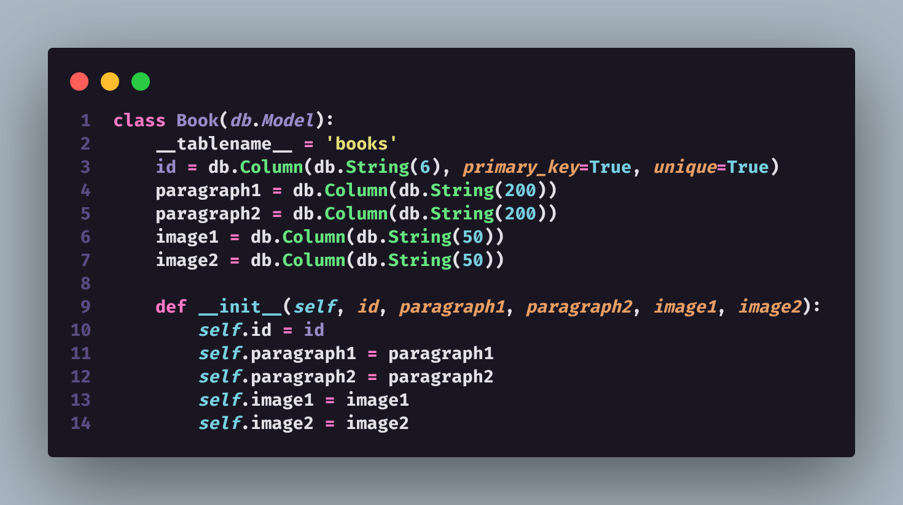

# Como Foi Desenvolver
Nos dois primeiros dias, busquei entender o que o desafio pedia para ter um melhor entendimento e assim poder resolver com mais facilidade. realizei a criação de um Todo-List no [Notion](https://www.notion.so/) para definir como seguiria nos próximos dias, que serão listados abaixo:.<br>

[ ] Definição do método de armazenamento de imagens que seria utilizado.<br>
[ ] Definição do Banco de dados que seria utilizado.<br>
[ ] Criação de um primeiro protótipo. <br>
[ ] Refatorar, Estruturar e melhorar o Código.<br>
[ ] Criação de um pequeno Frontend.<br>
[ ] Criação da Imagem Docker da aplicação e do banco de dados.

Optei por utilizar o micro-framework Flask para realizar o desafio, uma vez que já possuía familiaridade com ele. Ao seguir as tarefas citadas anteriormente, ao pesquisar por um método para armazenar as imagens, decidi salvá-las em uma pasta e armazenar somente o PATH do arquivo no banco de dados. pois eu já havia utilizada em um projeto anterior e se mostrou eficaz. A escolha do banco de dados foi fácil, pois já sabia que utilizaria um banco de dados SQL e optei pelo ```POSTGRES``` e tambem por utilizar o ```Flask_SqlAlchemy``` como ORM.

Com base nos requisitos acima mencionados, iniciei a criação do protótipo de um sistema bastante simples, destinado a avaliar se as estratégias seriam eficazes e se eu precisaria fazer alguma mudança para garantir seu bom funcionamento. No final, o protótipo contava com três rotas: ```create_book```, ```list_all_books``` e ```Find_by_id```. Além disso, ele possuía duas funções adicionais - ```generated_id``` e ```transform_Text``` - que consistiam em gerar o "magic_code" e salvar a imagem na pasta, respectivamente. O objetivo desta última função era retornar o PATH do arquivo para salvá-lo no banco de dados.

## Rotas

<hr>

## Funções

<hr>

## Schema
Conforme pode ser observado na imagem abaixo, o esquema do protótipo armazenava apenas o ID (magic_code), dois parágrafos do livro e duas imagens.



<hr>

<br>

Após verificar que o protótipo estava funcionando e cumprindo suas funções, comecei a fazer a refatoração e melhorar a arquitetura e a qualidade do código.

O primeiro passo foi estruturar as pastas conforme indicado abaixo:
```
app/
  - documentation/
  - routers/
  - schema/
  - service/
  - static/
        - css/
        - img/
        - js/
        - upload/
  - templates/
  docker-compose.yml
  dockerfile
  main.py
  README.md
```
<br>

## realizei algumas mudanças no código e nomes de metodos: 

Na minha nova abordagem para criar um livro, ao invés de instanciar uma classe na rota, como eu fazia no protótipo, agora eu chamo o meu serviço. Envio o magic_code (anteriormente chamado de ID), os dados e os arquivos recebidos no formulário.
<br>


<br>

No serviço, o método "create" é executado. Esse método tem como objetivo concatenar os dados recebidos em um único dicionário e instanciá-lo no objeto "Book", para, posteriormente, salvar todas as informações no banco de dados.


Quando os dados acima são passados para a instância de Book, eles são recebidos pelo construtor, que atribui cada valor ao seu respectivo campo dentro do objeto.

No caso das imagens, o método get_image_filename é acionado, recebendo como parâmetros a imagem, o código (mágico magic_code) e a posição da imagem. Este método é responsável por retornar o PATH do arquivo, permitindo que a imagem seja exibida no livro de forma adequada.


<br>

No método get_image_filename, o nome do método foi alterado de transform_text para get_image_filename. Além disso, foi adicionado um novo parâmetro que representa a posição da imagem. Essa alteração foi feita para substituir o uso de time.sleep(0.4) que havia sido adicionado anteriormente para evitar que a imagem fosse sobrescrita. Com a adição do parâmetro, não é mais necessário usar o time.sleep e, portanto, o método ficou muito mais rápido e a performance foi melhorada significativamente e o usuario não fica travado em uma operação.


<hr>

## schema final do BD


<hr>
<br>

O método utilizado para gerar o código mágico foi modificado. Agora, ele produz um código de 6 letras e verifica se algum código semelhante já existe no banco de dados. Caso não exista, ele retorna o código gerado; caso contrário, ele gera um novo código.


<br>

<hr>

<br>

Durante o desenvolvimento do desafio, não tive grandes problemas relacionados à implementação. O único problema mais significativo que encontrei foi com relação ao lib ```flask_SqlAlchemy```, que começou a apresentar muitos problemas de dependência circular. Como solução, decidi migrar para o ```SqlAlchemy```, o que acabou resolvendo o problema.

<br>

# Como executar o projeto

Para Executar o desafio basta, realizar o clone do repositorio e executar o comando abaixo:

```bash
$ docker-compose up --build
```
<hr>

## Rotas do projeto

Acesso a lista de livros ja cadastrados
<http://localhost:5000/book_router/>

Procura Livro pelo Código Mágico
<http://localhost:5000/book_router/find/{{code_magic}}>

Cadastra o seu livro
<http://localhost:5000/book_router/create>
